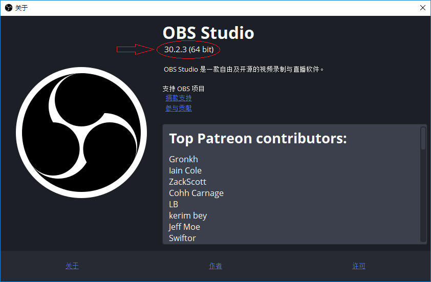
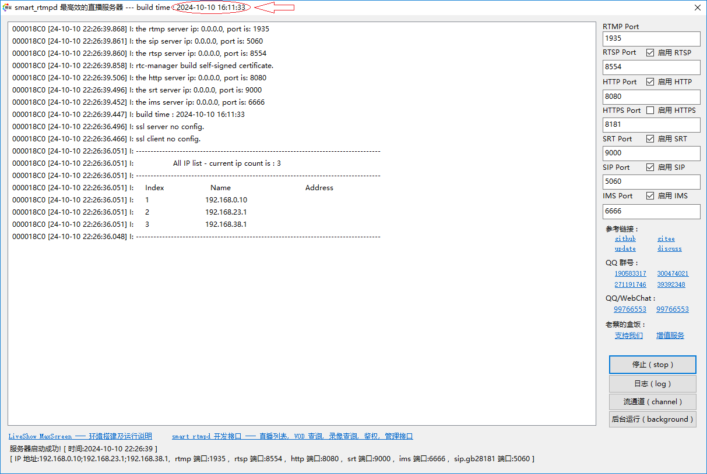
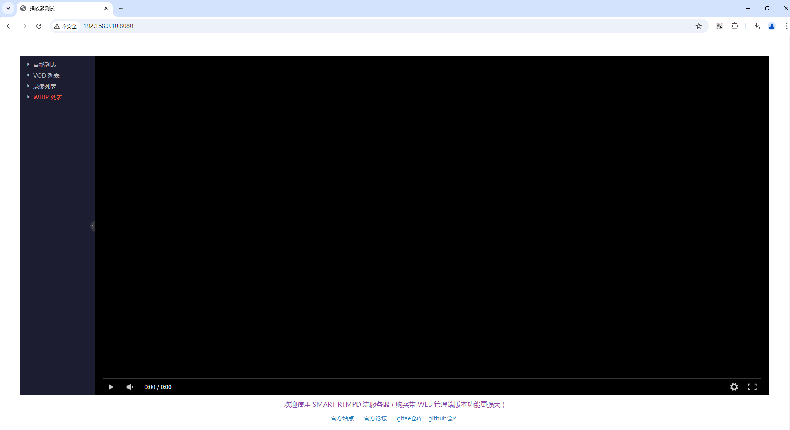
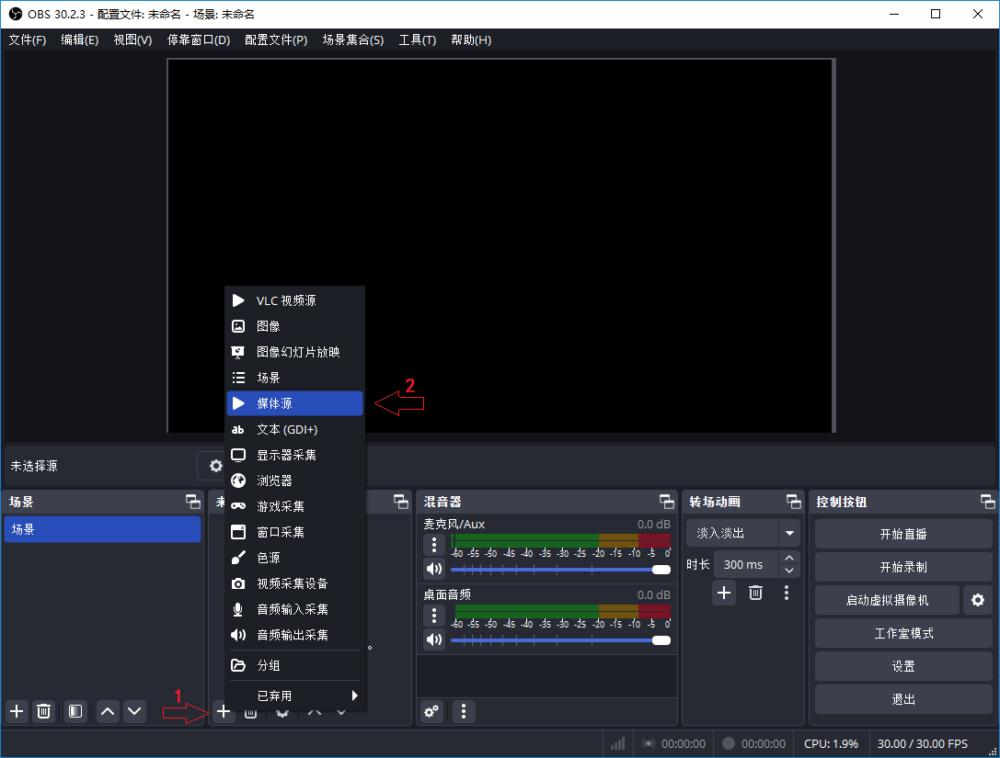
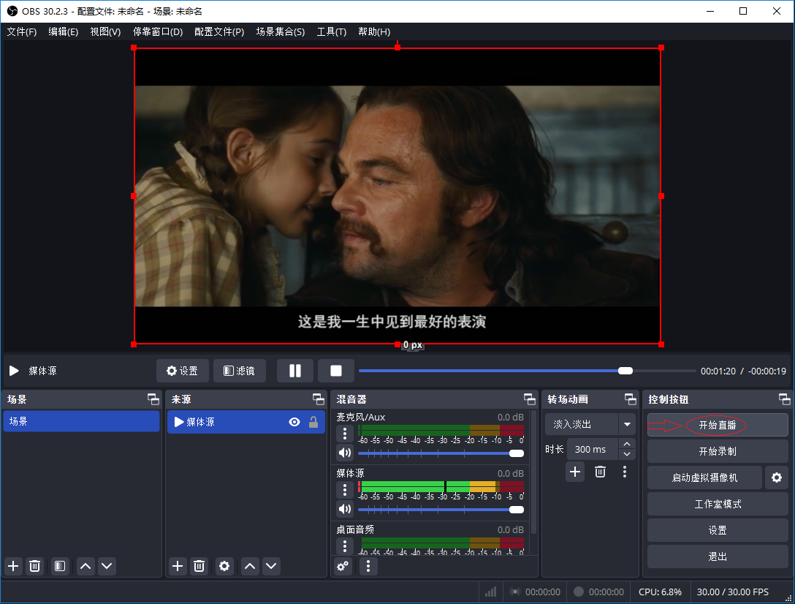
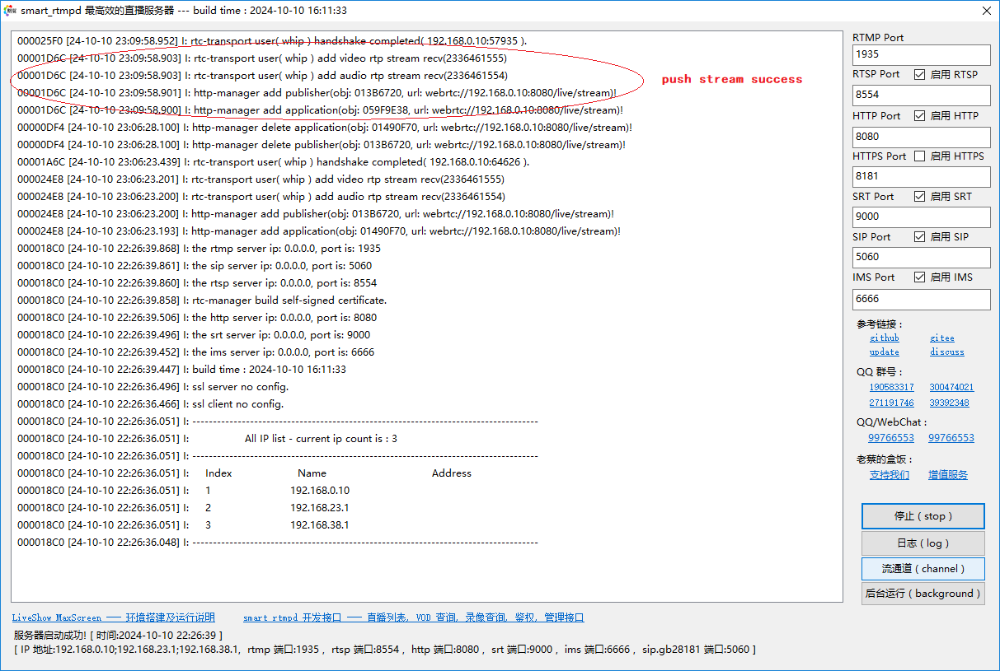
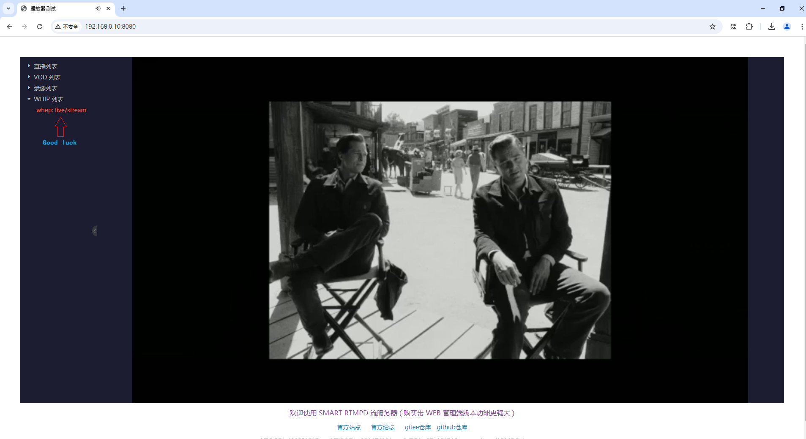

# webrtc whip 推流 & whep 拉流简介

### RFC 定义
通用的 webrtc 对于 SDP 协议的交换已经有对应的 RFC 草案出炉了。这就是 WHIP( push stream ) & WHEP ( pull stream ) .  
WHIP RFC Link: https://www.ietf.org/archive/id/draft-ietf-wish-whip-01.html  
WHEP RFC Link: https://www.ietf.org/archive/id/draft-murillo-whep-03.html

### 环境准备 
要搭建 whip 和 whep 的整体演示环境需要准备 WHEP 推流端，sfu 服务器端，whep 拉流端。这里采用 OBS 实现 WHIP ， smart rtmpd 实现 SFU， WEB player 实现 WHEP 。

1. OBS 准备  
OBS 支持 webrtc 的 WHIP 推流版本是 >= 30.0， 本文采用的是 Windows 版本的 30.2.3。下载地址为： https://obsproject.com/download  
  
只有版本符合的才支持 whip 推流

2. SFU 准备
smart rtmpd 支持 webrtc 的 WHIP/WHEP 版本是 >= 2024.10.10 ，本文采用的是 Windows 版本的 2024.10.10。下载地址为：https://github.com/superconvert/smart_rtmpd/blob/master/rtmpd.zip  
  
smart rtmpd 的版本是以日期命名的，格式是：年月日 时分秒

3. Web player 准备
smart rtmpd 自带的演示页面内就有 webrtc 的 WHEP 播放器，运行 smart rtmpd 后，只需输入 http://服务器地址:端口 就会进入 smart rtmpd 自带的主页面。
  
上图中 whip 列表包含所有的 whip 推流，点击其中一路，whep 播放器就会播放 webrtc 流

### OBS 推流
1. 添加媒体源  
  
选择一个 mp4 文件添加到窗口  
2. whip 设置  
  
点击 <设置> 按钮，进入设置主界面，点击 <直播> 按钮，选择 <服务> 为 "WHIP"， <服务器> 一栏填写 WHIP URL: "http://192.168.0.10:8080/whip/v1?app=live&name=stream"  
3. whip 推流  
  
点击 <开始直播> 按钮  

### 推流成功标志
  
服务器日志有 webrtc://192.168.0.10:8080/live/stream 的字样，基本上就表明推流成功了, live 就是 app 分类， stream 就是流的名字 name  

### Web player 拉流
  
访问 smart rtmpd 自带的主页面，最下面就会有 WHIP 列表，因为可能存在多路 webrtc 的 whip 推流，展开 WHIP 列表， 找到刚才的推流，点击就会通过 whep 播放 webrtc 的视频了。

### 视频演示
